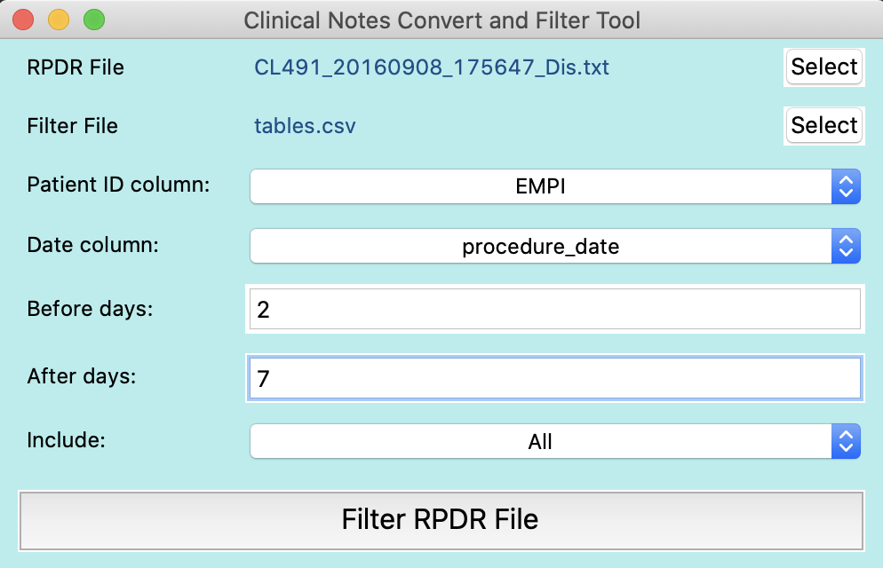

# RPDR_filter

## Install dependencies
```
sudo easy_install pip
pip3 install -r requirements.txt
```
## Start the Program
```
python3 main.py
```
## Convert RPDR to CSV


## RPDR Filter

You could filter an RPDR note file to include only notes from patients of interest and only notes for those patients within a specified time range. This could be used, for example, to find notes for a patient that are within X days before and Y days after a certain procedure. Note that if you want notes between 30 days and 60 days after the procedure, `before_days` would be -30 days and `after_days` would be 60 days.

### Filter file format

| patient id  | date | include (optional)     | 
| ----------- | ----------- | ----------------- | 
| 12345678    | 02/28/2020 | 1 | 
| 11111111    | 01/01/2019 | 0 | 
* The filter file should contain at least two columns: "patient ID (empi)" and "date (could be procedure date)"
* The default setting is including all the rows, but you could specify 1 or 0 to include or exclude that patient within a specified time range.
* Matches dates of formats: `'%m/%d/%Y','%Y/%m/%d','%m/%d/%y','%m-%d-%Y','%Y-%m-%d','%m-%d-%y','%b %d, %Y','%b %d, %Y','%B %d, %Y','%B %d %Y','%b %d,%Y'`

### Output file
The output file has the same format as the origin with `_filter_[before_days]-[after-days]` added to the filename.
